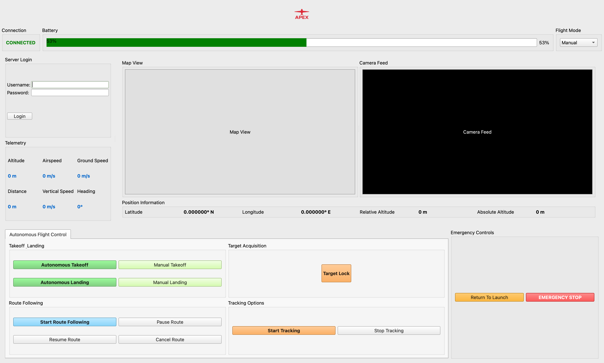

# UAV Control Interface

A modern and user-friendly ground control station interface for UAV aircraft control and monitoring.



## Features

- **Real-time Flight Controls**
  - Throttle control with percentage display
  - Attitude control (Roll, Pitch, Yaw)
  - Visual feedback for all control inputs

- **Status Monitoring**
  - Connection status
  - Battery level indicator
  - GPS information
  - Flight mode selection

- **Visualization**
  - Map view for navigation
  - Live camera feed support
  - Real-time position information

- **Mission Management**
  - Mission planning and control
  - Mission state management (Start, Pause, Resume)
  - Emergency controls with safety features

- **Advanced Settings**
  - Configurable flight parameters
  - Adjustable safety limits
  - Custom waypoint settings

## Installation

1. Clone the repository:
   ```bash
   git clone https://github.com/adilmustafayilmaz/UAV-Ground-Control-Station
   cd UAV-Ground-Control-System
   ```

2. Install required dependencies:
   ```bash
   pip install -r requirements.txt
   ```

## Usage

Run the application:
```bash
python uav_control_interface.py
```

### Control Layout

- **Left Panel**: Flight controls and telemetry
  - Throttle slider (0-100%)
  - Attitude controls (Roll, Pitch, Yaw)
  - Flight parameters
  - Telemetry display

- **Right Panel**: Visualization
  - Map view
  - Camera feed
  - Position information

- **Bottom Panel**: Mission Control
  - Mission management buttons
  - Emergency controls

## Development

The interface is built using:
- Python 3.x
- PyQt5 for the GUI
- Modular architecture for easy expansion

## Safety Features

- Emergency stop button
- Return to launch functionality
- Safe landing procedure
- Visual warnings and indicators

## Contributing

1. Fork the repository
2. Create your feature branch
3. Commit your changes
4. Push to the branch
5. Create a new Pull Request

